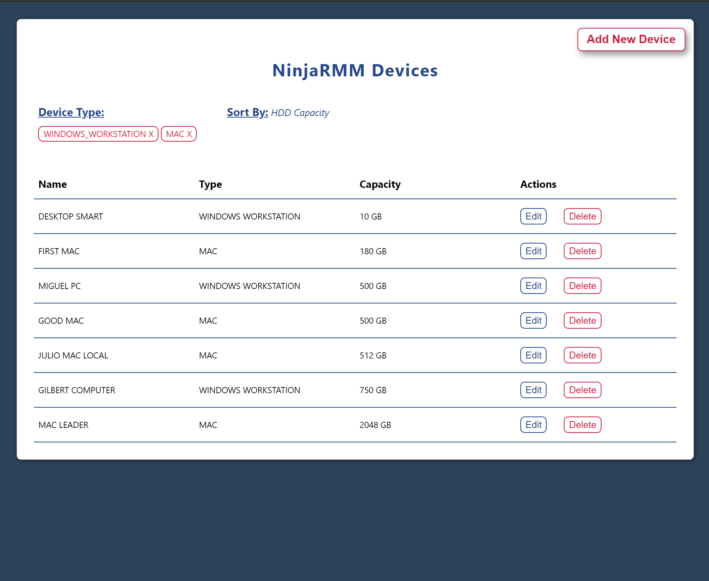
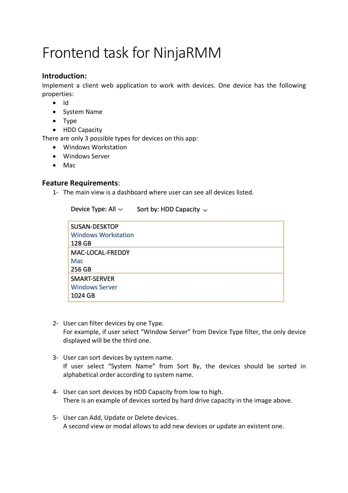
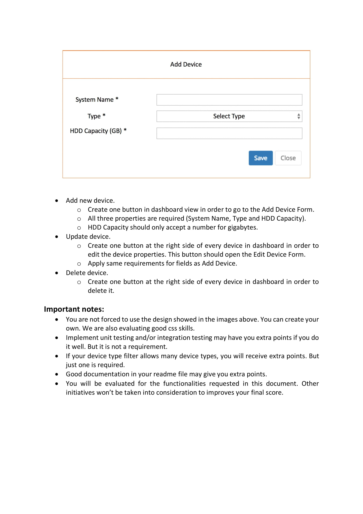
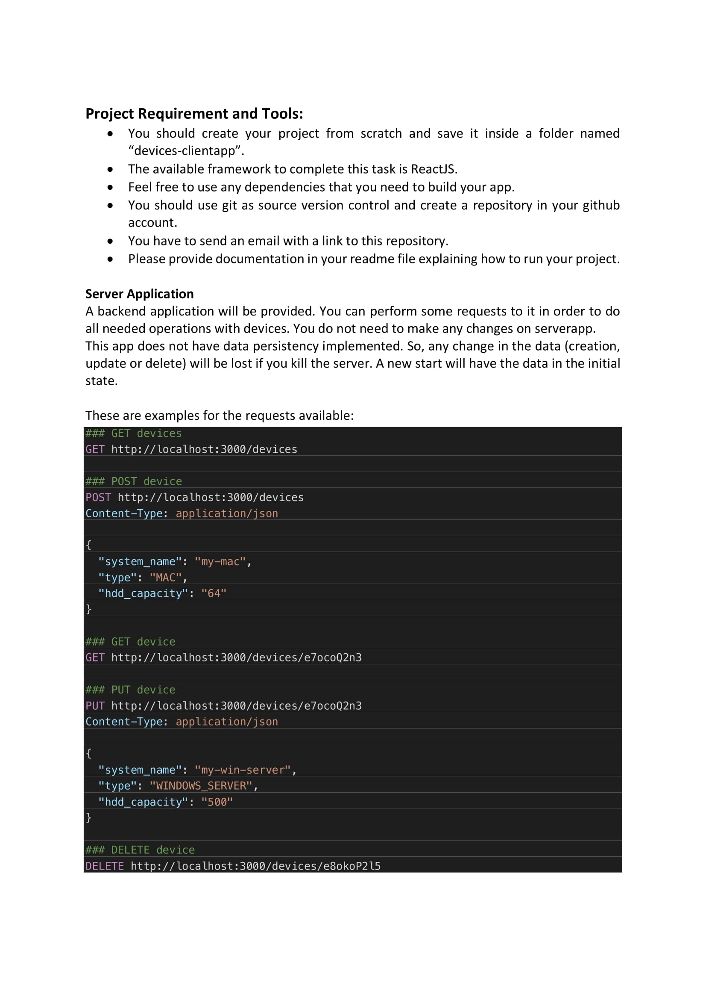

# NinjaRMM Interview Project

## Screenshots




## How to run

_This was built with NodeJS v16.2 and npm v7.13._

__In each of the two directories:__

```bash
npm install
npm start
```

The front-end will be served on port 3001, since the local api will use port 3000 by default.

## Dependencies

I deliberately kept the dependencies minimal, since this is an interview project and you'll want to see my code, not someone else's.

- `styled-components` because inventing classNames is so Y2K
- `ramda` because I heard NMM uses it

- Because I did not depend on any prebuilt components, I manually built:
  - Modals (With Portal)
  - Forms
  - Table
  - Dropdown
  - Text Select Dropdown (Single choice and multi choice)
  - Panel
  - Input Text
  - Input Number
  - Multiple Buttons

## General Structure

When a component is complex, it'll be in it's own "ComponentName" folder. That folder will contain:
- styles.jsx (The styled-components shared within that folder)
- utils.js (Utilities not generic enough to be in the global /utils/ folder)
- ComponentName.jsx (Will match the name of the folder, I think index.jsx makes debugging harder)


```
/api
  Contains some functions for fetching the devices api.
  Notice that withApiDataHoc.js.

/components
  /Common (Reusable (pure) components that depend on props, never context)
  /pages (Page Components)
    /DevicesPageFull ("Full" would indicate it's responsible for it's own header, sidebar, footer, etc.)
      This is the one and only Page in the App
  /*
    Everything else is considered not reusable (not pure), in the sense that it might use a context.

/state
  Would contain any context / reducer combos
  /devices
    The reducer that stores all device data, and the provider that wraps the DevicePageFull

/theme
  The styled-components theme object passed to the ThemeProvider in App

/utils
  Generic Utility functions accessible to the entire app. All re-exported in index.js for easy importing.
```

## Notes

- The Table supports multiple filters
- Not much in the way of design, but I picked some colors from Ninjarmm.com
- At first glance, you're going to think I overengineered this project. This could have been done with just a few components and a few files, all specifically written for this App. Since this an interview project, I wanted to demonstrate some techniques, that the project didn't call for.
  - I built most things from scratch. (_In practice, I would have used a prebuilt Table, Dropdown & Modal_)
    - I deliberately made some components too reusable/configurable, even though they obviously will never be used beyond this project.
  - I made the `<Table>` in such a way that I could demonstrate these techniques:
    - The use of styling based on props (`size`)
    - The use of renderProps (`renderTableActions` and `renderRowActions`)
  - I created and used the `withApiDataHoc` HOC just to demonstrate the use of a complicated Higher Order Component for API retrieval.
    - It wraps a component and provides the following as props: _api response data, loading and error states, and a reFetch function._
    - This is the sort of pattern you see with Apollo Client's HOCs that they provide for each Query or Mutation. I just wanted to demonstrate that I __could do__ it, but please don't judge me on the decision __to do__ it lol
  - When the API data is returned, I stored it in a Context (`/state/devices/context`), accessible to the entire page via a Provider, and updatable via a reducer. In this case, it was overkill to store one thing in a context. But I wanted to demonstrate it since this is an interview project. In reality, I could have just stored it in local state.
    - I considered storing all of the type filters, sorting column, filtered rows, etc. in the context, but wanted the `devicesTable` to manage it's own filtering and sorting, so that if you had two of them, they could each look different.
  - I created several `/utils` that are built to be curried so that I could demonstrate "Generalized" and "Specialized" functions.
    - A good example is the generalized `/utils/arrays/filterObjectsWithKeyAmong()` and the specialized `/DevicesTable/devicesTableUtils.js/filterDevicesByType()`
- If I had more time, I'd write unit tests with testing-library/react, and I'd refactor the `DevicesTable` because it got out of hand (really long and too many callbacks in it)

---

# These are the instructions provided by NinjaRMM




